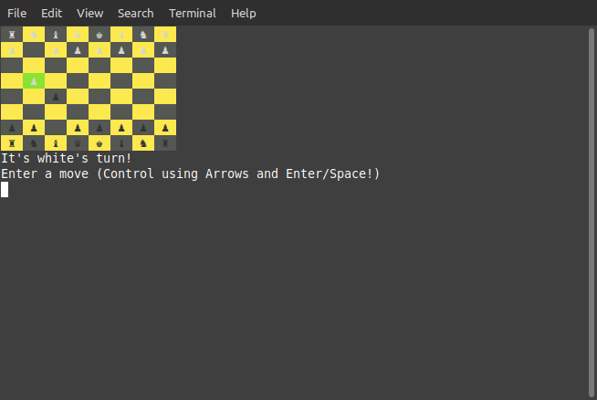
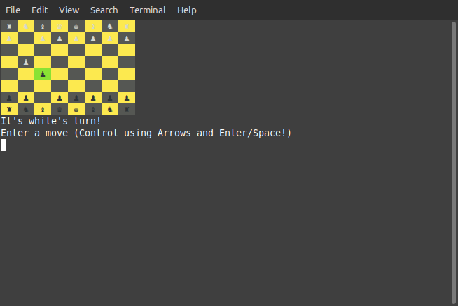
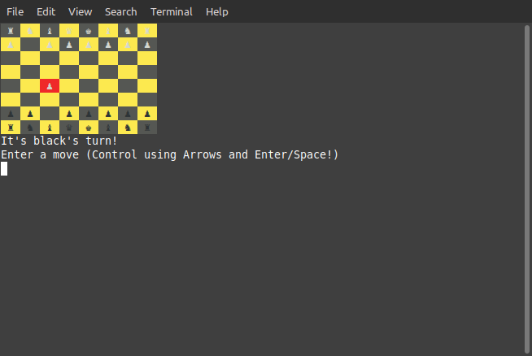
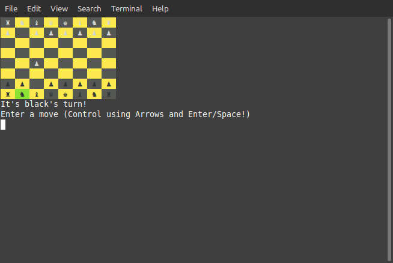
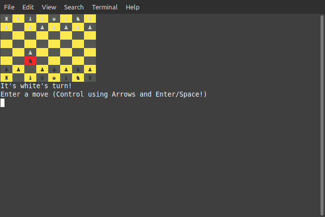

# Chess

## Table of contents
* [Installation](#installation)
* [Chess](#chess)
    * [Introduction](#introduction)
    * [Usage](#usage)
    * [Demo](#demo)
    
## Installation
- It's required to install [ruby 2.7.0](https://www.ruby-lang.org/en/documentation/installation/)

    - If already installed try to get version Using *Comamnd* 
    ```bash 
    ruby -v
    ```
- It's prefered to install [pry on Ruby](https://www.sitepoint.com/pry-a-simple-start/#:~:text=To%20start%20pry%2C%20simply%20type,the%20Rails%20console%20with%20Pry.)
    - If already installed try to get version Using *Comamnd* 
    ```bash 
    pry -v
    ```
    
## Introduction
In this project I built a Chess game :D


## Usage 

> **_NOTE:_** Make sure you are in the same directory of project files

open `CMD` or `Terminal`, and `cd` to the project directory

In trermial write 

```bash
pry
```
then in pry write

```ruby
load 'game.rb'
g = Game.new
g.play
```
It works!! :smiley:

## Demo 











